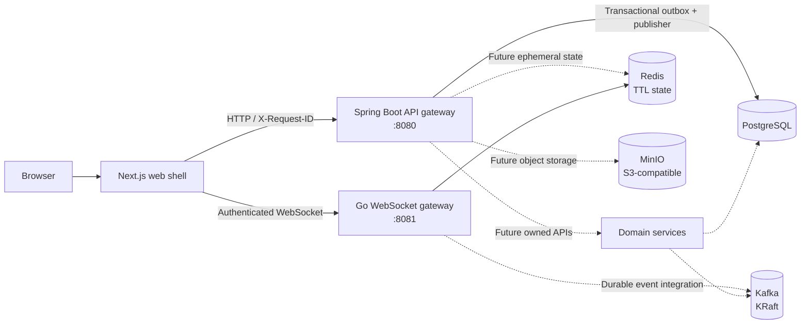

# Uvya

Uvya is a production-oriented, Telegram-like real-time messaging platform being built incrementally. This repository contains the engineering foundation and the first authentication/security foundation; chat and messaging business features are intentionally not implemented yet.

## Foundation milestone

This milestone provides:

- a clean monorepo layout and contribution conventions;
- a minimal Next.js web shell;
- a Spring Boot HTTP API gateway with liveness/readiness endpoints and request ID propagation;
- a Go WebSocket gateway with authenticated handshakes, Redis-backed connection routing,
  multi-device delivery, reconnect synchronization, bounded backpressure, heartbeat,
  graceful shutdown, and connection/reconnect metrics;
- local PostgreSQL, Redis, Kafka in single-node KRaft mode, and MinIO;
- architecture documentation and ADRs for the initial system shape and MVP message-storage choice;
- a Spring Security authentication foundation with PostgreSQL accounts/devices/sessions/audit records, JWT access tokens, rotated opaque refresh cookies, and Redis-backed login/OTP state;
- a Phase 1 PostgreSQL data foundation with chats, memberships, explicitly sequenced messages, reactions, versions, inbox/read state, blocks, idempotency, a transactional outbox, and versioned event schemas;
- an activated Kafka event backbone with an idempotent producer, consumer groups, immediate/delayed retries, dead-letter topics, correlation IDs, durable consumer idempotency, health, and lag metrics;
- a User Service foundation with privacy-aware profiles, discoverability, blocked-user enforcement, paginated lookup, hashed contact matching, mutual-contact detection, and Redis profile caching;
- a Chat Service foundation with direct/group/channel models, centralized session/device/role authorization, paginated membership access, channel posting policy, and membership race protection;
- Dockerfiles, Compose orchestration, and GitHub Actions checks.

Future domain services are documented boundaries, not empty placeholder applications. They will be added with their first real contract and tests.

## Prerequisites

The supported clean-machine path requires:

- Docker Desktop with Compose v2;
- Git;
- 8 GB RAM available to Docker for the full local stack;
- ports `3000`, `5432`, `6379`, `8080`, `8081`, `9000`, `9001`, and `9092` available.

Native Maven, Go, and Node installations are optional for the Docker-based path. They are required only for the corresponding `make test` and `make lint` targets when run directly on the host.

## Start locally

From the repository root, create the ignored local environment file and start the stack:

PowerShell:

```powershell
Copy-Item .env.example .env
docker compose up --build -d
docker compose ps
```

Bash:

```bash
cp .env.example .env
docker compose up --build -d
docker compose ps
```

The first start downloads pinned images and builds the three application containers, so it can take several minutes. Kafka uses KRaft and therefore does not start Zookeeper.

## Verify locally

PowerShell:

```powershell
Invoke-WebRequest http://localhost:8080/health/live | Select-Object -ExpandProperty Content
Invoke-WebRequest http://localhost:8080/health/ready | Select-Object -ExpandProperty Content
Invoke-WebRequest http://localhost:8081/health/live | Select-Object -ExpandProperty Content
Invoke-WebRequest http://localhost:8081/health/ready | Select-Object -ExpandProperty Content
Invoke-WebRequest http://localhost:3000 | Select-Object -ExpandProperty StatusCode
Invoke-WebRequest http://localhost:9000/minio/health/live | Select-Object -ExpandProperty StatusCode
docker compose ps
```

Bash:

```bash
curl --fail http://localhost:8080/health/live
curl --fail http://localhost:8080/health/ready
curl --fail http://localhost:8081/health/live
curl --fail http://localhost:8081/health/ready
curl --fail http://localhost:3000
curl --fail http://localhost:9000/minio/health/live
docker compose ps
```

Expected health responses include `"status":"UP"` and an `X-Request-ID` response header.

Authentication smoke test after startup:

```bash
curl -i -c cookies.txt -H 'Content-Type: application/json' \
  -d '{"email":"alice@example.com","password":"correct horse battery staple","deviceName":"laptop"}' \
  http://localhost:8080/v1/auth/register
```

The response contains the short-lived access token; the refresh token is set as an HttpOnly cookie. Browser clients should first call `GET /v1/auth/csrf`, then send its `X-XSRF-TOKEN` value on refresh and logout.

## Useful commands

```bash
docker compose logs -f
docker compose logs -f api-gateway ws-gateway
docker compose restart
docker compose down
docker compose config --quiet
```

The local volumes are retained by `docker compose down`. To deliberately remove local database, Redis, Kafka, and MinIO data, run `docker compose down -v`.

The Makefile provides equivalent lifecycle commands where `make` is available:

```bash
make up
make ps
make config
make down
```

## Repository layout

```text
apps/web                 Next.js web shell
services/api-gateway     Spring Boot HTTP edge process
services/ws-gateway      Go WebSocket edge process
packages/contracts       Versioned API/event contract home
packages/frontend-types  Frontend-safe generated type home
infrastructure           Local and future deployment documentation
tests                    Integration, load, and security test homes
docs/architecture        System and engineering conventions
docs/adr                 Architecture decision records
.github/workflows        Continuous integration
```

## Architecture



Solid edges represent the currently runnable entry points. Dashed edges are deliberate future integration boundaries; the API-to-Kafka event backbone is active for the listed domain events.

## Engineering conventions

- [Foundation architecture](docs/architecture/foundation.md)
- [Engineering conventions](docs/architecture/engineering-conventions.md)
- [Phase 1 data-foundation audit](docs/architecture/phase-1-audit.md)
- [User Service architecture](docs/architecture/user-service.md)
- [Chat Service architecture](docs/architecture/chat-service.md)
- [ADR-001: Initial architecture](docs/adr/ADR-001-initial-architecture.md)
- [ADR-002: MVP message storage](docs/adr/ADR-002-postgresql-for-mvp-message-storage.md)
- [Contributing](CONTRIBUTING.md)

## Current scope and next milestone

Authentication details and security invariants are documented in [the authentication architecture](docs/architecture/authentication.md). Persistence, shared event contracts, the activated [Kafka event backbone](docs/architecture/event-backbone.md), the User Service, and the Chat Service are documented in [the data-foundation audit](docs/architecture/phase-1-audit.md), [the contracts package](packages/contracts/events/README.md), [the User Service architecture](docs/architecture/user-service.md), and [the Chat Service architecture](docs/architecture/chat-service.md). Message HTTP APIs and frontend functionality remain future milestones.
