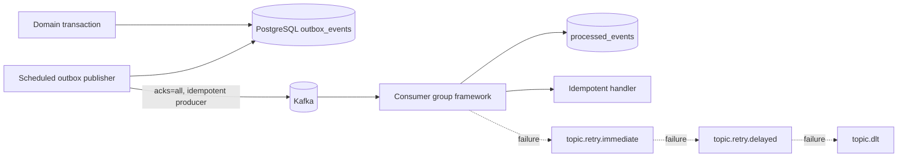

# Kafka event backbone

The API gateway now activates Kafka as the durable asynchronous backbone for database-originated events.

## Flow

The domain write and its outbox row are committed together. The publisher claims a locked batch, waits for Kafka acknowledgement, and only then marks each outbox row as published. A crash after Kafka acknowledgement but before the database commit can publish a duplicate; that is intentional and safe because event IDs are stable and consumers deduplicate them.

## Topics and keys

The base topics are:

`message.created`, `message.edited`, `message.deleted`, `message.delivered`, `message.read`,
`message.reaction.added`, `message.reaction.removed`, `message.pinned`, `message.unpinned`, `chat.created`, `group.member.added`,
`group.member.removed`, `notification.requested`, `search.index.requested`, `moderation.reported`,
and `analytics.event`.

Every base topic has `.retry.immediate`, `.retry.delayed`, and `.dlt` companion topics. The key resolver enforces:

- message events → `chatId`;
- reaction events → `messageId`;
- presence events → `userId`;
- notification events → `userId`.

Other aggregate events use `chatId` when available and otherwise the event ID as a safe fallback. The key is preserved when an event is routed to a retry topic, so ordering remains stable for that event stream.

## Retry and dead letters

The consumer framework commits an event only after its handler and the processed-event insert succeed. A failed base event is synchronously republished to the immediate retry topic. A failed immediate retry is sent to the delayed retry topic with a `not-before` header. The consumer waits until that timestamp, using exponential backoff with bounded random jitter, and sends a still-failing event to the dead-letter topic with a bounded error header.

If Kafka cannot accept the retry publication, the listener throws and the original Kafka record remains eligible for broker/container redelivery. Malformed envelopes follow the same listener error path because they cannot be safely routed without a valid event identity.

## Idempotency and consumer groups

`processed_events` has a unique constraint on `(consumer_group, event_id)`. The insert and the handler side effect share one database transaction: handler failure rolls the insert back, while a duplicate event becomes a no-op. A second consumer group may process the same event independently, as Kafka semantics require.

Scale-out instances use the same configured group ID and therefore share partitions. Independent projections or services use different group IDs and each receives the full event stream.

Message fan-out runs in its own `uvya-fanout` consumer group. It consumes
`message.created`, `message.delivered`, reactions, and pin transitions (including their immediate and delayed
retry topics), so fan-out load can scale independently from other event handlers.
The first event determines recipients and active devices; a route is only a network
attempt. Durable inbox state and the delivery acknowledgement endpoint own the
delivery lifecycle.

## At-least-once is the honest guarantee

The system chooses at-least-once delivery plus idempotent consumers. Exactly-once processing across PostgreSQL, Kafka, external notification providers, search indexes, and analytics systems would require every side effect to participate in one distributed transaction. Kafka producer idempotence prevents some producer duplicates, but it cannot make those unrelated systems commit atomically.

At-least-once makes the failure window explicit: a consumer may execute again after a crash between its side effect and offset acknowledgement. Durable event IDs, a consumer-owned idempotency record, monotonic domain updates, and provider idempotency keys turn that replay into a safe operation. This is more observable and recoverable than pretending a global exactly-once boundary exists.

## Metrics and health

Actuator exposes Kafka health through the readiness check. The event metrics include published/failed/consumed/duplicate/retry/dead-letter counters, processing time, pending outbox rows, broker status, and `kafka.consumer.lag` gauges labelled by consumer group, topic, and partition. Lag is sampled from the Kafka high watermark when a record is received; it is diagnostic and never blocks event handling.
