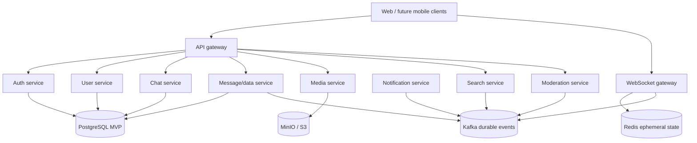

# Uvya foundation architecture

## Scope

This document describes the initial repository and runtime foundation. It does not claim that domain capabilities already exist.

## Current runtime

The local Compose stack contains:

- a Next.js web shell;
- a Spring Boot HTTP API gateway;
- a Go WebSocket gateway process with connection lifecycle reserved for the realtime milestone;
- PostgreSQL for relational persistence;
- Redis for TTL-backed ephemeral state and future connection routing;
- Kafka in single-node KRaft mode for future durable asynchronous events;
- MinIO for local S3-compatible object storage.

The API gateway now exposes the authentication foundation documented separately: PostgreSQL-backed accounts, devices, sessions, and audit records; JWT access tokens; rotated opaque refresh tokens; and Redis-backed login/OTP state. Its Phase 1 data foundation adds PostgreSQL-backed chats, memberships, explicitly sequenced messages, inbox/read state, reactions, versions, blocks, idempotency records, and a transactional outbox. Message HTTP endpoints, sophisticated Kafka consumers, and WebSocket authentication remain future contracts.

## Target evolution

This is a target boundary map. A service becomes real only when its contract, owned data, failure behavior, and automated tests are introduced together.

## Durability and ordering rules

1. A durable message is accepted only after a database transaction or durable-log acceptance succeeds.
2. Gateway memory is connection state only; it is never the offline message store.
3. `clientMessageId` is the idempotency key for client retries.
4. Ordering is scoped per chat. A global order is neither required nor promised.
5. Important database-originated events use a transactional outbox.
6. Consumers are idempotent and can be retried.
7. Direct chats and small groups start with fan-out-on-write. Large groups and channels can use fan-out-on-read or a hybrid model later.
8. Redis TTLs hold presence, typing, and connection-routing state; PostgreSQL or a later durable message store holds offline messages.

## Deployment progression

The foundation uses Docker Compose for repeatable local startup. Kubernetes, Helm, Terraform, and production observability deployments are deferred until service contracts and runtime resource profiles are known. This keeps infrastructure proportional to demonstrated requirements.
